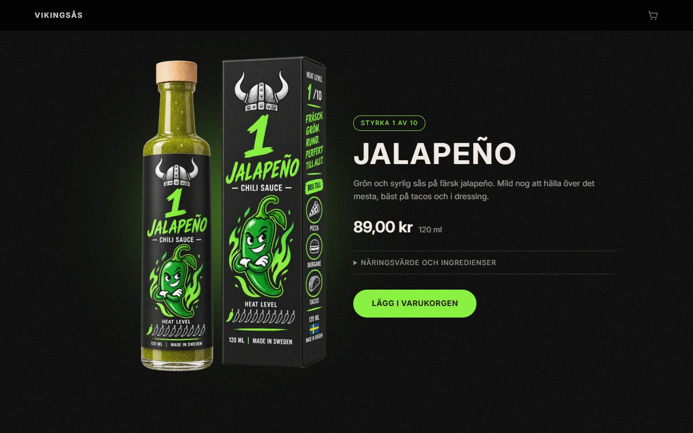
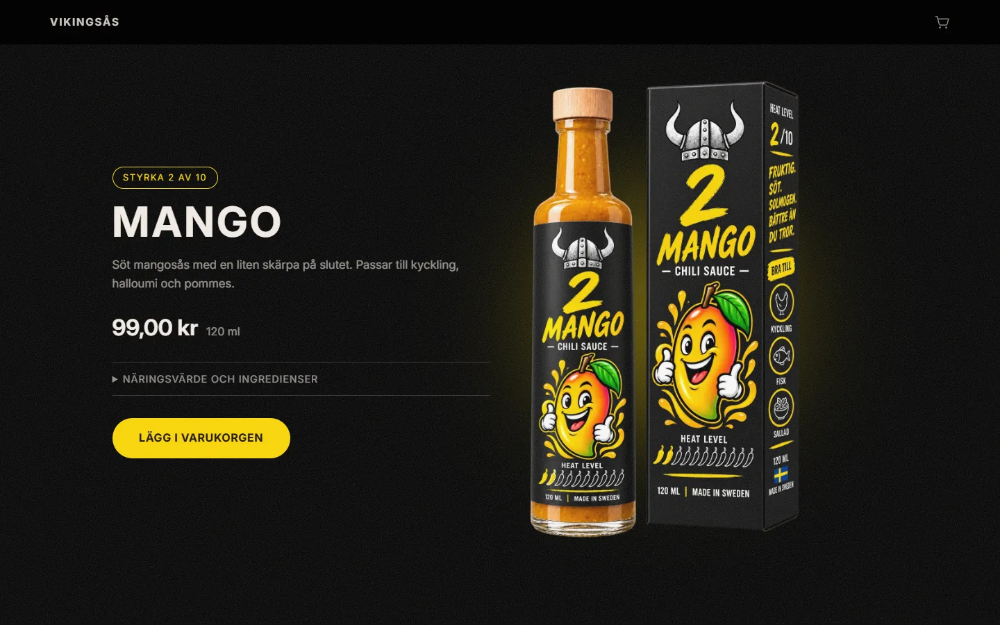
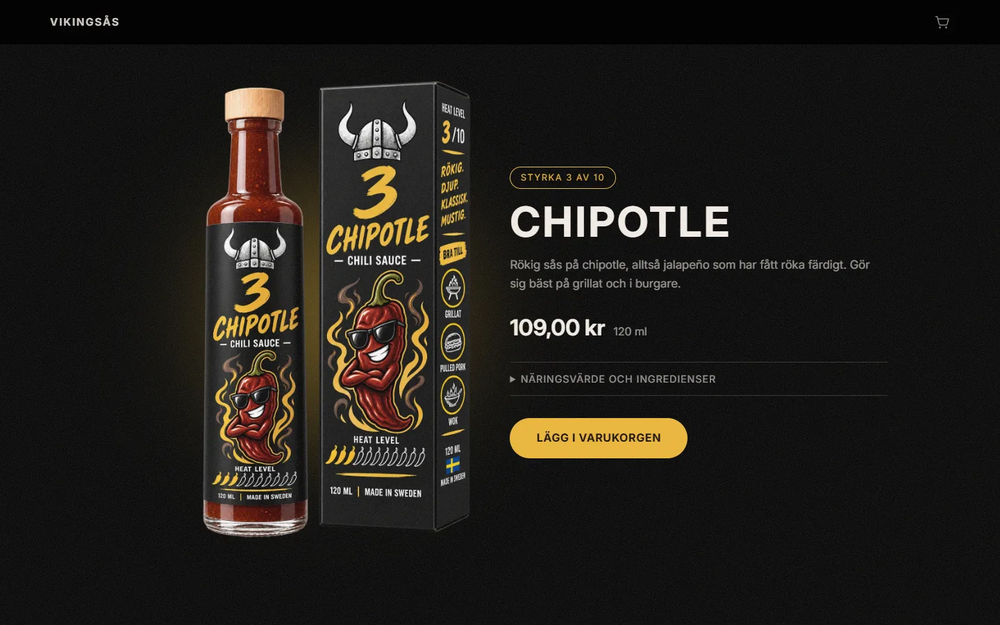
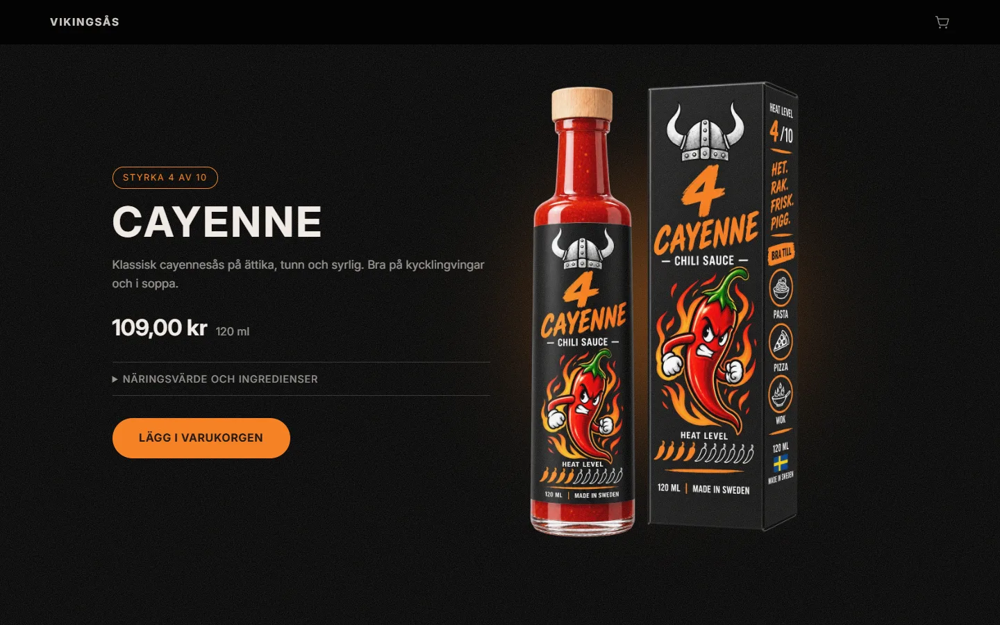
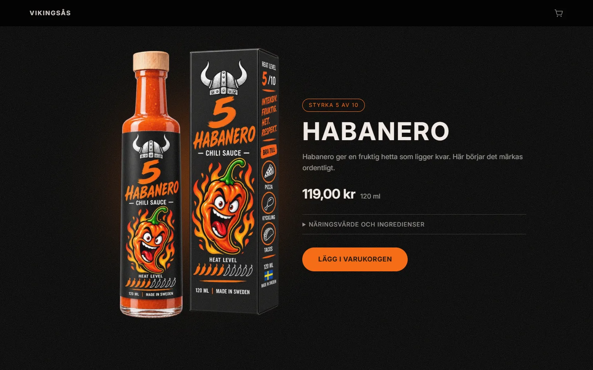
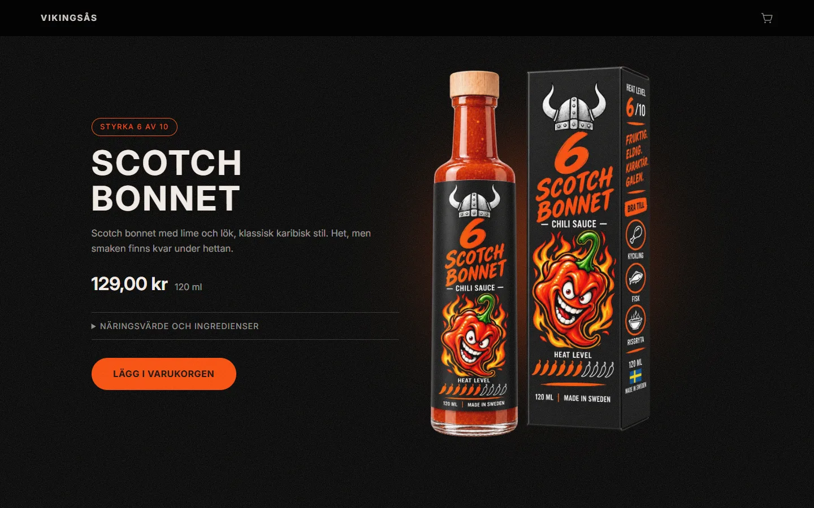
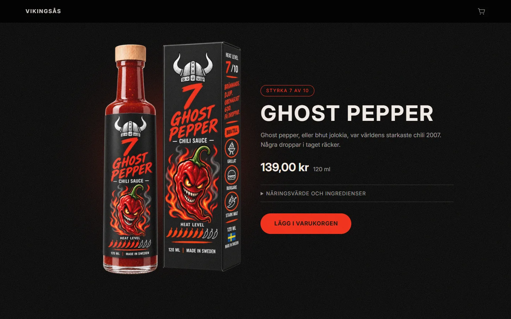
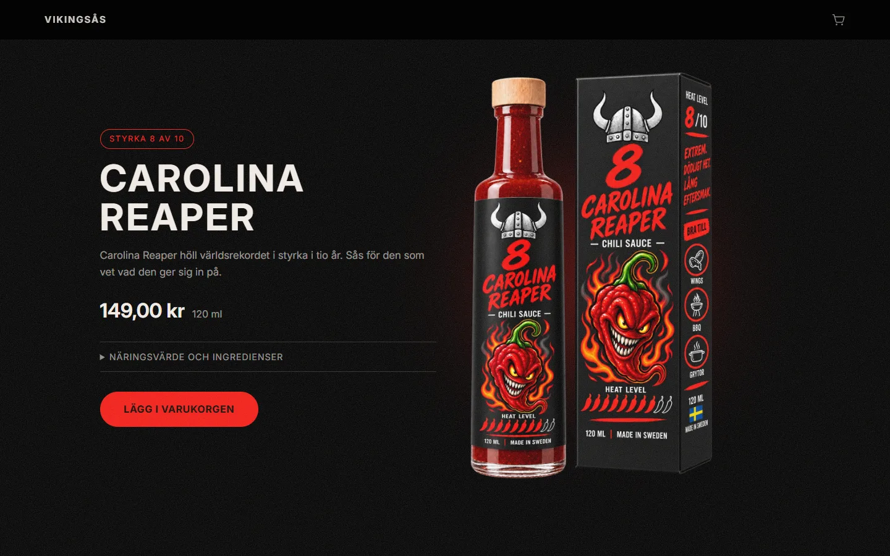
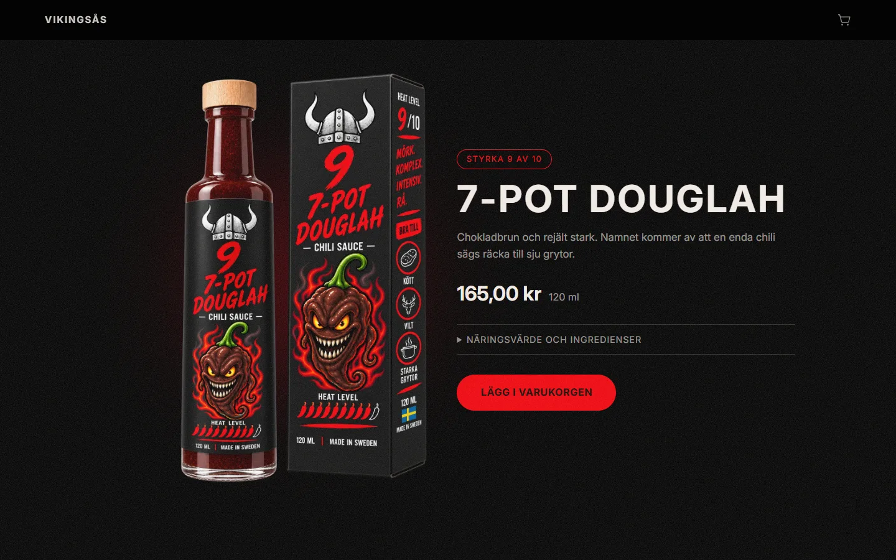
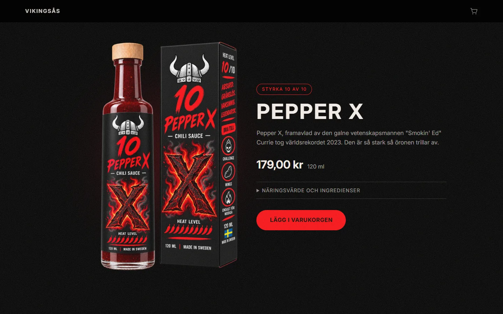

[](https://classroom.github.com/a/r1QxwNOh)

# Vikingsås

E-handel med tio chilisåser i stigande styrka, från en mild jalapeño till Pepper X. Byggd som skoluppgift i kursen Systemutveckling på Medieinstitutet.

Sajten ligger på https://chili-ehandel.vercel.app


## Om uppgiften

Uppgiften hette "Min egna e-handel" och gick ut på att bygga en butik som fungerar för både kunder och administratörer. Admin lägger till och redigerar produkter som sparas i databasen. Kunden ser produkterna, lägger dem i en varukorg, "betalar" och skapar en order som admin sedan kan se. Betalningen är bara ett formulär med namn och e-post, ingen riktig betallösning. Sidan skulle också vara deployad så att andra kan se den.

Innan bygget skulle tidsplan, sitemap och ER-diagram tas fram. De ligger i [docs/](docs/).

För VG skulle dessutom:

- varukorgen sparas i databasen istället för bara i React
- det finnas inloggning så att bara administratörer kan redigera produkter
- admin kunna sätta orderstatus: Beställd, Behandlas, Levererad, Återbetald

Alla krav för både G och VG är uppfyllda.

## Produkterna

Varje sås har en egen sektion på startsidan med styrka, pris och en utfällbar ruta för näringsvärde och ingredienser. Glöden bakom flaskan och knappen har samma färg som etiketten.

<p>
  
  
  
  
  
  
  
  
  
  
</p>

## Funktioner

### Kund

- alla aktiva produkter på startsidan
- varukorg som sparas i databasen och kopplas till besökaren med en cookie, kunder behöver inte logga in
- kassa med namn och e-post
- tacksida med ordernummer

### Admin

- inloggning med express-session, sessionerna sparas i Postgres och lösenorden hashas med bcrypt
- skapa och redigera produkter, och slå av eller på dem med en switch
- lista med alla ordrar och en detaljsida per order
- ändra orderstatus

Adminpanelen länkas inte från butiken, den nås på `/admin/logga-in`.

## Tekniker

- React, Vite och React Router
- Express 5 och TypeScript
- PostgreSQL hos Supabase, egen SQL via `pg`
- express-session med connect-pg-simple, bcryptjs
- Vercel

## Vad jag övade på

- rita ett ER-diagram och bygga tabellerna efter det
- spara produktnamn och pris på orderraden, så att en gammal order inte ändras när admin ändrar priset
- transaktioner, en order och dess rader sparas allt eller inget
- `json_agg` för att hämta en order med alla rader i en och samma fråga
- sessionsbaserad inloggning och middleware som skyddar admin-routes
- React Context för antalet i varukorgen
- deploy med Vercel CLI

## Kom igång

Installera beroenden:

```
npm install
```

Kopiera `.env.example` till `.env` och fyll i `DATABASE_URL`.

Starta sedan två terminaler, en för frontend och en för API:et:

```
npm run dev
npm run dev:api
```

Frontend hamnar på http://localhost:5173 och API:et på http://localhost:3000. Vite skickar vidare allt som börjar med `/api` till Express, så webbläsaren ser bara en adress och jag slipper CORS.

## Kommandon

| Kommando            | Gör                                                     |
| ------------------- | ------------------------------------------------------- |
| `npm run dev`       | startar frontend                                        |
| `npm run dev:api`   | startar API:et, läser `.env` och startar om vid ändring |
| `npm run build`     | typkontroll med `tsc -b`, sedan bygger frontend         |
| `npm run preview`   | visar det byggda resultatet lokalt                      |
| `npm run lint`      | kör oxlint                                              |
| `npx vercel --prod` | deployar till produktion                                |

## Databas

SQL:en körs manuellt i Supabase SQL editor, det finns ingen automatisk migrering.

- `db/schema.sql` skapar tabellerna
- `db/seed.sql` lägger in de tio produkterna. Körs bara en gång, `title` är inte unik så en andra körning ger dubbletter

Supabase-projektet får inte pausas, då slutar den deployade butiken visa produkter.

## Deploy

Vercel är inte kopplat till GitHub eftersom projektet ligger på Medieinstitutets konto, CLI:n laddar upp filerna som ligger på disk. Därför gäller ordningen:

```
git commit -am "..."
git push
npx vercel --prod
```

Hoppa inte över push, annars börjar produktionen och repot skilja sig åt.

Kontrollera efteråt att API och databas svarar, https://chili-ehandel.vercel.app/api/health ska ge:

```
{"status":"ok","products":10}
```

Vercel kör `vite build` i molnet, inte `npm run build`. Typkontrollen sker alltså bara lokalt, körs innan deploy.

## Om något strular

**`Error: Not authorized` vid deploy.** Inloggningen är borta. Kör `npx vercel login`, välj GitHub, kontrollera sedan med `npx vercel whoami`.

**npx vill installera `vercel` igen.** Normalt, inget fel. npx cachar paketet och hämtar senaste versionen när cachen är tom.

**Produkterna syns inte på sajten.** Kolla `/api/health` först. Svarar den med ett felmeddelande ligger problemet i databasen, inte i frontend.

## Dokumentation

Tidsplan, sitemap och ER-diagram ligger i [docs/](docs/).
